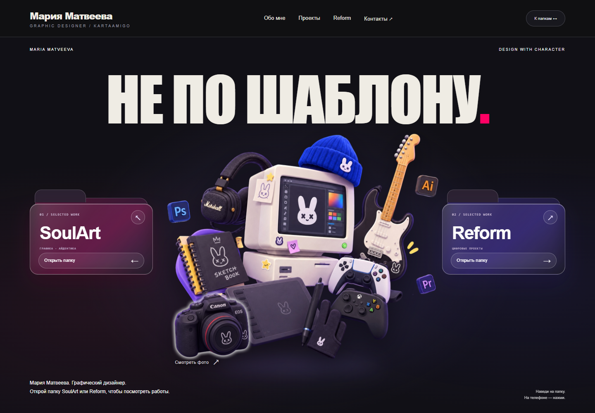
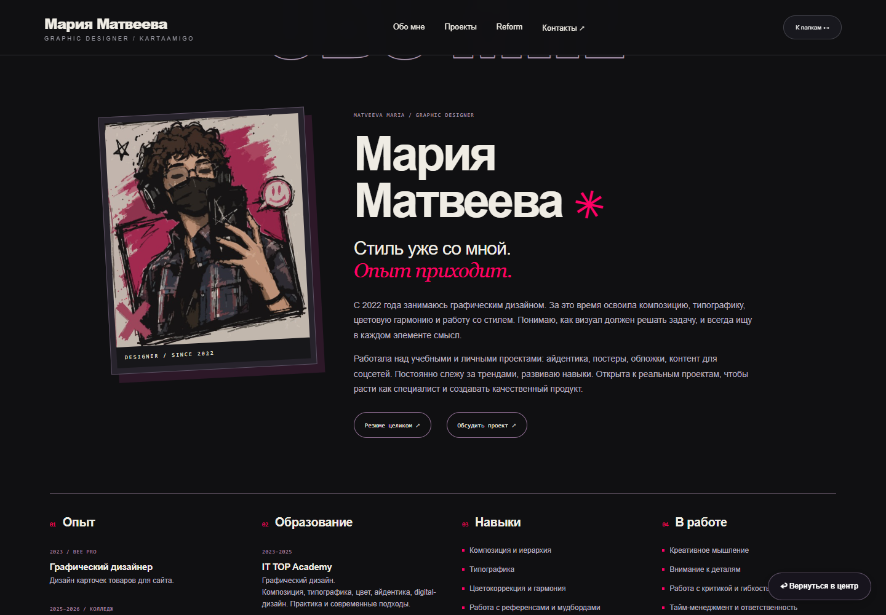
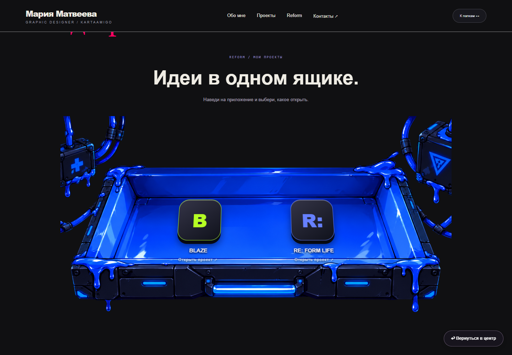
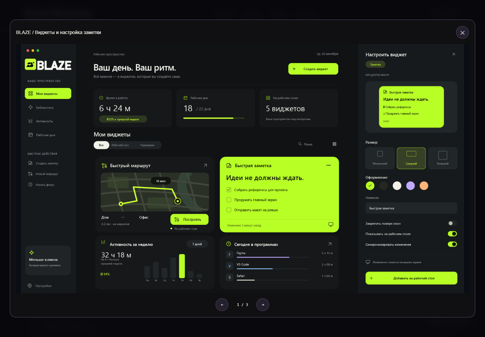
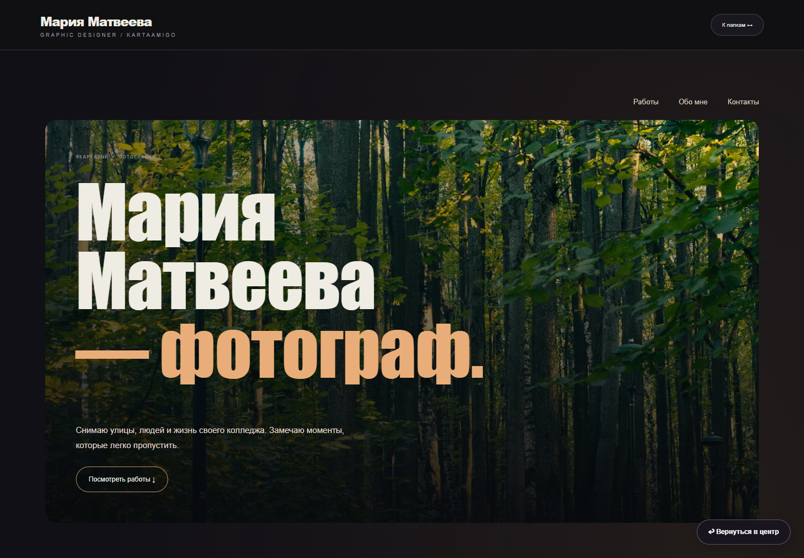

<div align="center">

# НЕ ПО ШАБЛОНУ.
### Мария Матвеева / KARTAAMIGO
Личное портфолио - дизайн, цифровые проекты и фотография.


**SoulArt · RE: FORM · #Картавый**

</div>



> **Сайт ещё в процессе разработки.** Это отдельная сохранённая наработка на 6 октября 2026 года. Первый экран и взаимодействия уже собраны; нижние разделы продолжают дорабатываться. Макеты приложений показывают дизайн, а не подтверждают готовность опубликованных продуктов.

## Три направления одного автора

| Направление | Что внутри |
| --- | --- |
| **SoulArt** | Графический дизайн, авторская подача, информация об авторе и избранные работы |
| **RE: FORM** | Цифровые идеи и интерфейсы BLAZE и RE: FORM LIFE |
| **#Картавый** | Стрит-фотография, тематические подборки и съёмка жизни колледжа |

Reform - одно из направлений личного портфолио. В центре сайта остаётся автор.

## Уже сделано

- Главный экран с заголовком «НЕ ПО ШАБЛОНУ.», двумя интерактивными папками и авторской центральной иллюстрацией.
- Раскрытие папок при наведении, переход по клику и касанию, возврат к главному экрану.
- Анимированные иконки Photoshop, Illustrator и Premiere; приветствие при взаимодействии с синей шапкой.
- Вход в фотографию через камеру с мягким белым свечением.
- Синий ящик Reform с выбором BLAZE и RE: FORM LIFE; описания и увеличиваемые экраны приложений.
- Фотопортфолио с 22 снимками в пяти подборках, просмотром без обрезки, стрелками, свайпами и закрытием по Escape.
- Разделы «Обо мне», проекты и контакты; адаптация к мобильным экранам и поддержка reduced motion.
- 22 скриншота текущего прототипа и 7 дополнительных изображений, предоставленных автором.

## Посмотреть дизайн

<table>
<tr><td width="50%"><strong>SoulArt / Обо мне</strong><br></td><td width="50%"><strong>Reform / Выбор приложения</strong><br></td></tr>
<tr><td><strong>BLAZE / Интерфейс</strong><br></td><td><strong>#Картавый / Фотография</strong><br></td></tr>
</table>

[Все скриншоты текущего сайта](personal-portfolio-concept/github-screenshots/README.md) · [Дополнительные скриншоты автора](docs/author-screenshots/README.md) · [Обзор 22 экранов](docs/screenshots-overview.png)

## Что ещё в процессе

- Окончательная компоновка и дизайн нижних разделов SoulArt.
- Наполнение категории «Жизнь колледжа» - пока оставлено место для будущих фотографий.
- Авторский портрет для фотопортфолио, подробные серии и реальные даты съёмок.
- Дальнейшая полировка адаптивной версии и контента.
- Отдельное решение о публикации сайта. Этот репозиторий хранит исходники; GitHub Pages пока не включён.

## Запустить локально

Сайт написан на HTML, CSS и JavaScript. Сборка и установка пакетов для просмотра не нужны.

```bash
python -m http.server 8893 --bind 127.0.0.1
```

Открыть `http://127.0.0.1:8893/` или `http://127.0.0.1:8893/personal-portfolio-concept/folders.html`.

Важно запускать сервер из корня репозитория: текущая страница использует общие стили и изображения из соседней папки `dual-world/`.

## Как устроены файлы

```text
index.html                      Вход в текущую версию
personal-portfolio-concept/      Текущий прототип и предыдущие варианты
  folders.html                  Основная страница
  assets/                       Иллюстрации, макеты и оптимизированные фото
  github-screenshots/            22 скриншота десктопной и мобильной версии
  DESIGN-HANDOFF.md              Согласованные решения и ограничения
dual-world/                     Общие стили, сцены и визуальные материалы
docs/                           Дополнительные материалы и статус работы
```

`combined.html`, `experimental.html` и `folders-compact.html` сохранены для истории и сравнения. Текущая основная версия - `folders.html`.

[Статус и план работы](docs/STATUS.md) · [Решения по дизайну](personal-portfolio-concept/DESIGN-HANDOFF.md)

## Автор и материалы

**Мария Матвеева / kartaamigo** · [Telegram](https://t.me/designeramigo) · [GitHub](https://github.com/kartaamigo)

Авторские фотографии, иллюстрации и макеты сохранены вместе с исходниками для продолжения работы. Лицензия на свободное использование этих материалов не предоставлена.

Оригиналы фотографий сохранены локально. В репозитории лежат все 22 фотографии в WebP и их миниатюры, которые использует сайт.
