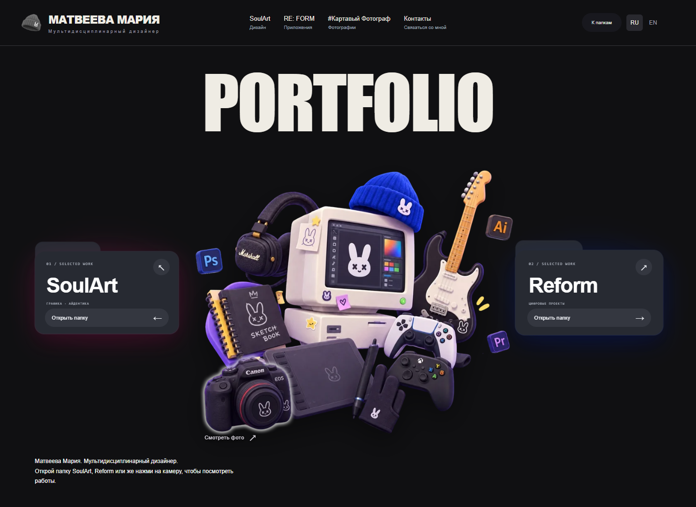

<div align="center">

[](https://kartaamigo.github.io/)

# Portfolio / Work in Progress

**Разработка авторского сайта-портфолио Марии Матвеевой.**

Графический дизайн · Цифровые проекты · Фотография

[Открыть сайт ↗](https://kartaamigo.github.io/) · [English ↗](https://kartaamigo.github.io/index.en.html) · [Контакты ↗](https://kartaamigo.github.io/personal-portfolio-concept/contacts.html)

</div>

---

## Идея проекта

Сайт объединяет три направления моей работы в одном пространстве. Вместо обычного списка проектов - рабочий стол с папками SoulArt и RE: FORM и камерой, которая открывает фотопортфолио. Каждый раздел получает своё оформление и цвет.

Этот репозиторий хранит исходники, сохранённые этапы разработки, визуальные материалы и опубликованную версию сайта.

## Три стороны портфолио

| SoulArt | RE: FORM | Картавый фотограф |
| :--- | :--- | :--- |
| **Дизайн и визуальная коммуникация** | **Цифровые проекты и интерфейсы** | **Фотография и визуальные истории** |
| Айдентика, постеры, обложки, вёрстка книг и журналов. | UI/UX, создание сайтов, BLAZE и RE: FORM LIFE. | Тематические серии, съёмки и авторские подборки. |
| Розовый акцент | Синий акцент | Коричневый акцент |

## Как выглядит сайт

[](https://kartaamigo.github.io/)

[Открыть опубликованную версию](https://kartaamigo.github.io/) · [Посмотреть архив экранов](personal-portfolio-concept/github-screenshots/README.md)

## Что есть в опубликованной версии

- Рабочий стол с интерактивными папками и входом в фотопортфолио через камеру.
- Разделы об авторе, проектах и направлениях работы; переходы между мирами и возврат на главный экран.
- Кейсы с Behance, превью цифровых проектов и просмотр фотографий.
- Русский и английский языки, адаптивное оформление для телефона.
- Отдельная страница контактов и форма отправки сообщений на почту.
- Шапочка рядом с именем и значок вкладки, которые меняют цвет вместе с выбранным разделом.
- Восстановление выбранного раздела при обновлении страницы; новая вкладка открывает главный экран.
- Изображения и шрифты внутри сайта, HTTPS и файлы для поисковых систем.

Проект продолжает развиваться: уточняются оформление, материалы и взаимодействия. Представленные экраны приложений показывают дизайн проектов; они не означают, что каждый продукт уже опубликован как отдельный сервис.

## Версии и публикация

| Ветка | Назначение |
| :--- | :--- |
| [`main`](https://github.com/kartaamigo/portfolio-work-in-progress/tree/main) | Сохранённый этап разработки, документация, исходные материалы и архив экранов. |
| [`gh-pages`](https://github.com/kartaamigo/portfolio-work-in-progress/tree/gh-pages) | Опубликованная версия сайта, включая последние правки интерфейса. |

Главная ссылка: **[kartaamigo.github.io](https://kartaamigo.github.io/)**. Короткий адрес публикуется из отдельного [репозитория сайта](https://github.com/kartaamigo/kartaamigo.github.io).

Эта копия проекта также доступна через [GitHub Pages](https://kartaamigo.github.io/portfolio-work-in-progress/personal-portfolio-concept/folders.html).

<details>
<summary><strong>Запустить опубликованную версию локально</strong></summary>

HTML, CSS и JavaScript. Установка пакетов и сборка не нужны.

```bash
git clone --branch gh-pages https://github.com/kartaamigo/portfolio-work-in-progress.git
cd portfolio-work-in-progress
python -m http.server 8080
```

Откройте `http://localhost:8080/personal-portfolio-concept/folders.html`.

Запускайте сервер из корня репозитория: страница использует общие файлы из соседних каталогов. Форма контактов отправляет сообщения через FormSubmit и требует подключения к интернету.

</details>

<details>
<summary><strong>Файлы и материалы проекта</strong></summary>

```text
personal-portfolio-concept/   Страницы, интерактивные элементы и оформление
dual-world/                   Общие стили, сцены и визуальные материалы
docs/                         Документация сохранённого этапа разработки
.github/readme/               Обложка и актуальное превью для этого README
```

В ветке `gh-pages` также находятся `shared-fonts/` с локальными шрифтами и их лицензиями, значки сайта и манифест для браузерных ярлыков.

[Решения по дизайну](personal-portfolio-concept/DESIGN-HANDOFF.md) · [Архив скриншотов](personal-portfolio-concept/github-screenshots/README.md) · [Дополнительные материалы](docs/author-screenshots/README.md)

Документы и архивные экраны в `main` описывают соответствующий этап разработки и могут отличаться от опубликованного сайта.

</details>

## Автор

**Мария Матвеева / Kartaamigo** - мультидисциплинарный дизайнер и фотограф.

[Behance](https://www.behance.net/tuumiyurmirazh) · [GitHub](https://github.com/kartaamigo) · [Pinterest](https://ru.pinterest.com/x1ghostxsoul1x/) · [Telegram](https://t.me/designeramigo) · [Почта](mailto:xghostxsoulx@gmail.com)

Авторские фотографии, иллюстрации и макеты сохранены для работы над портфолио. Разрешение на их свободное использование не предоставлено. Лицензии сторонних шрифтов сохранены вместе с файлами.

---

<div align="center">

**SOULART · RE: FORM · PHOTOGRAPHY**

[Посмотреть портфолио ↗](https://kartaamigo.github.io/)

</div>
