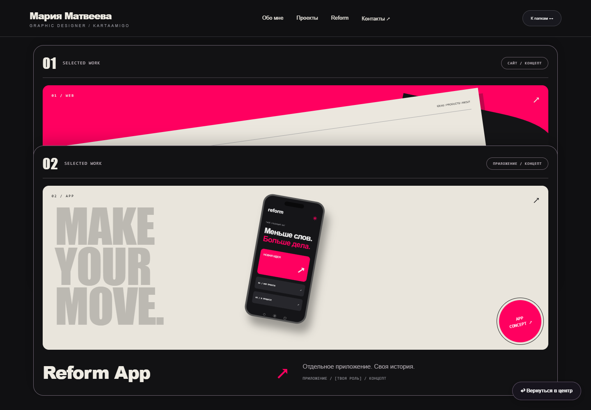
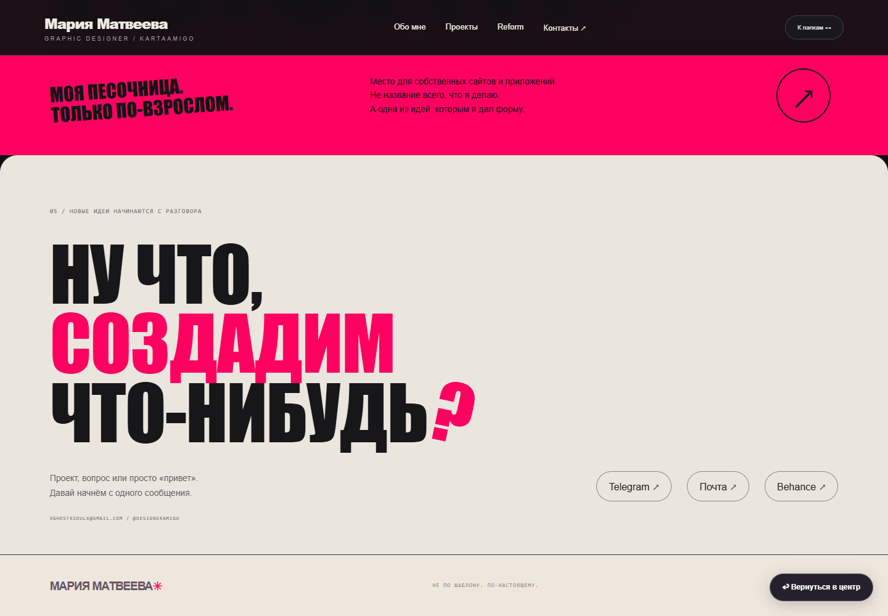
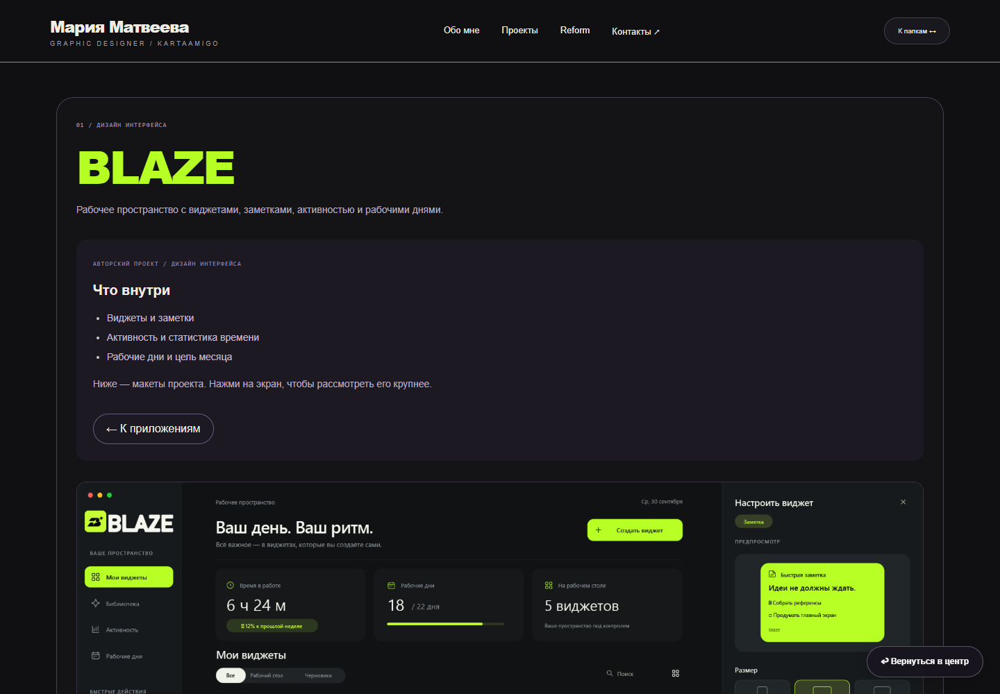
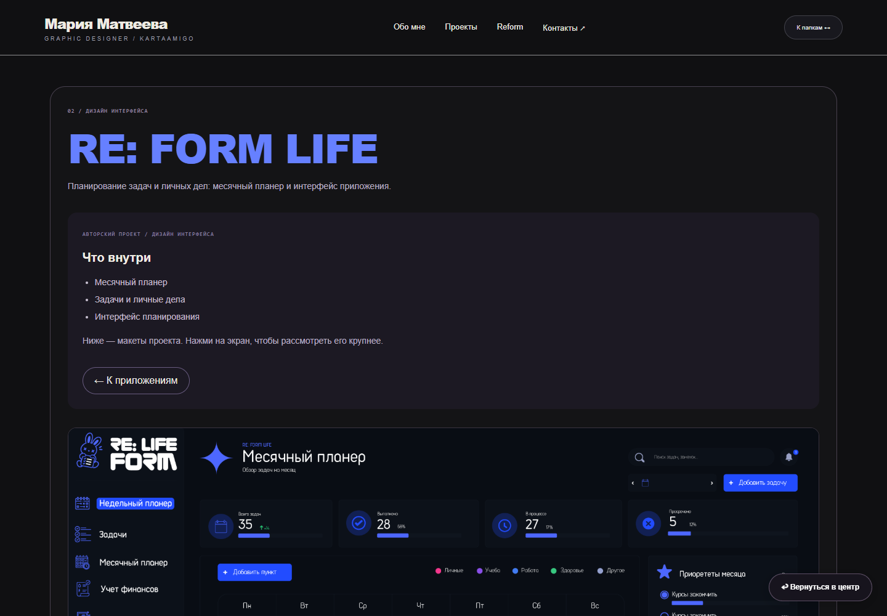
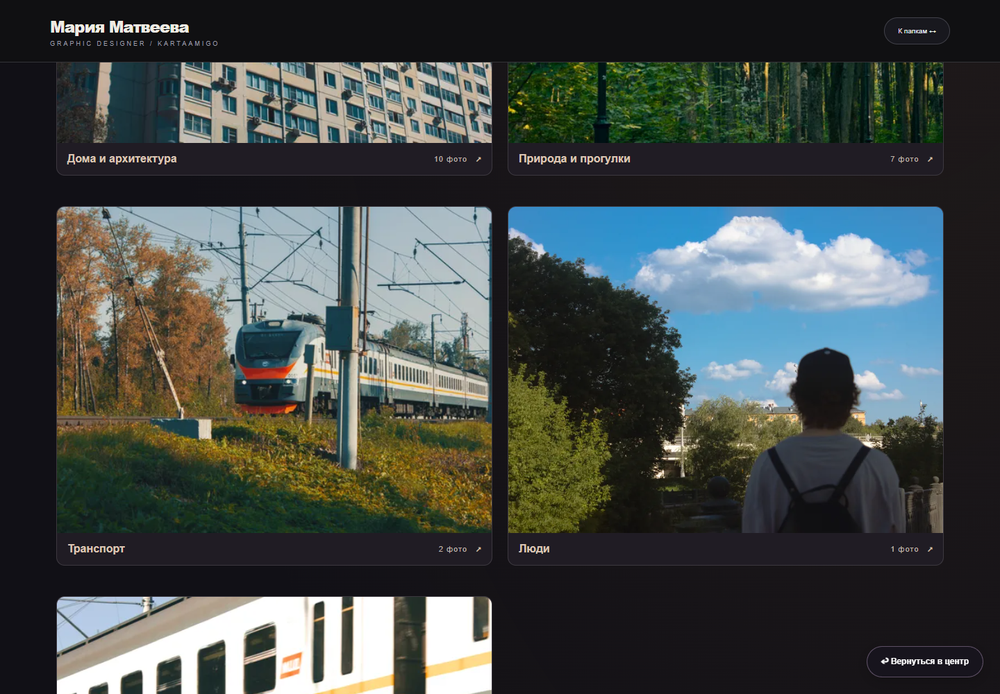
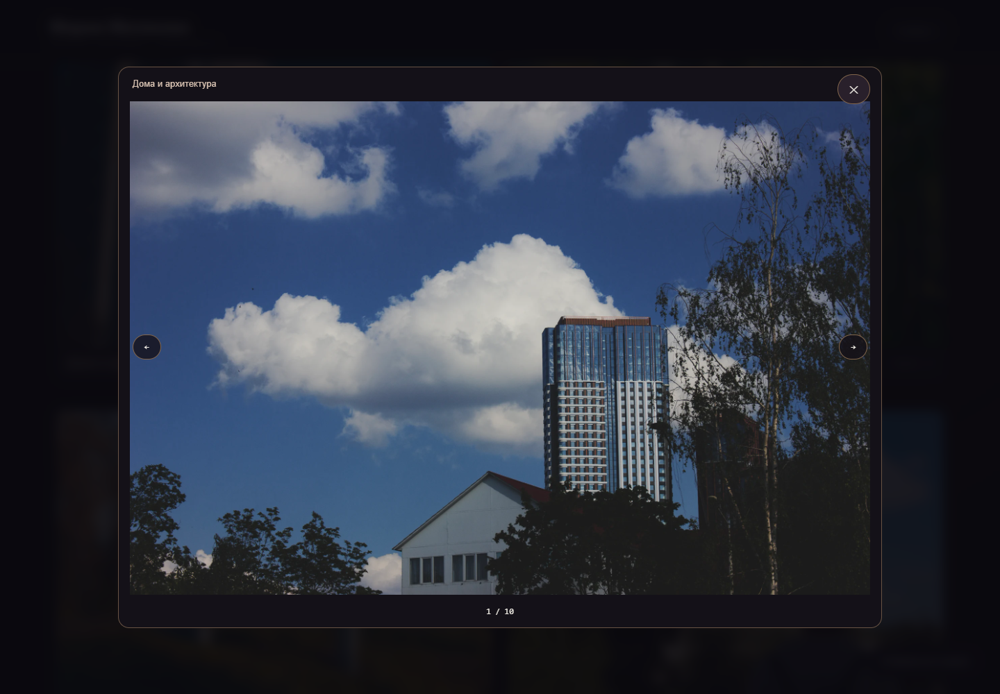
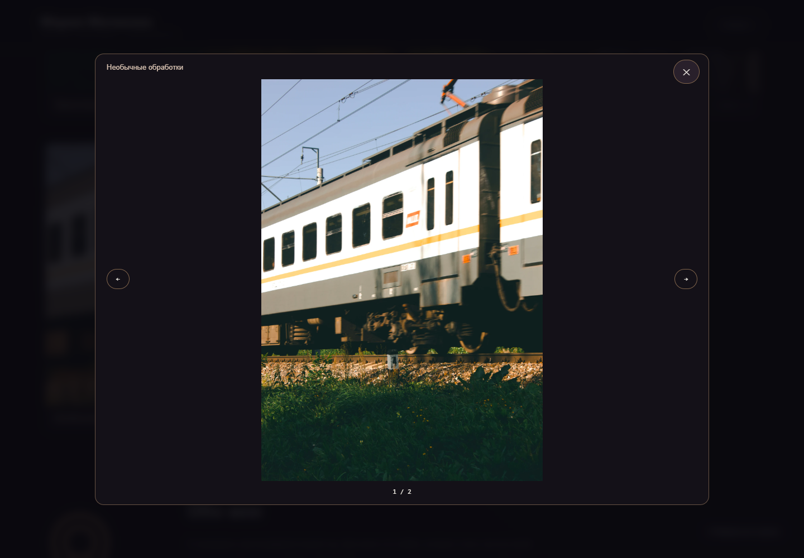
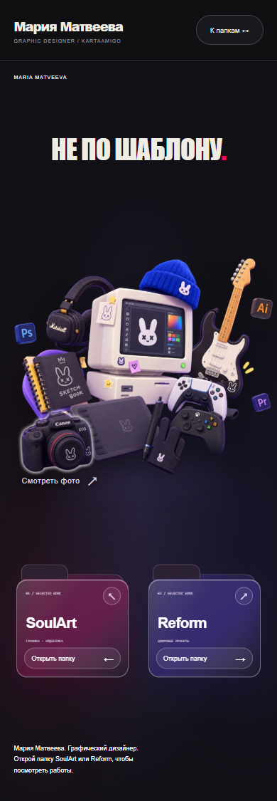
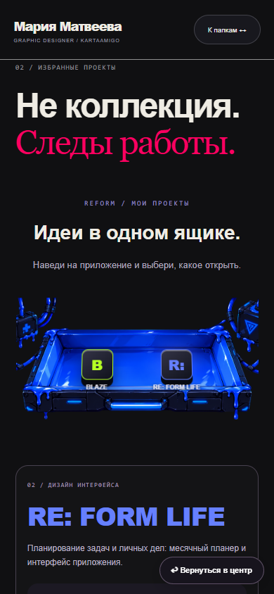
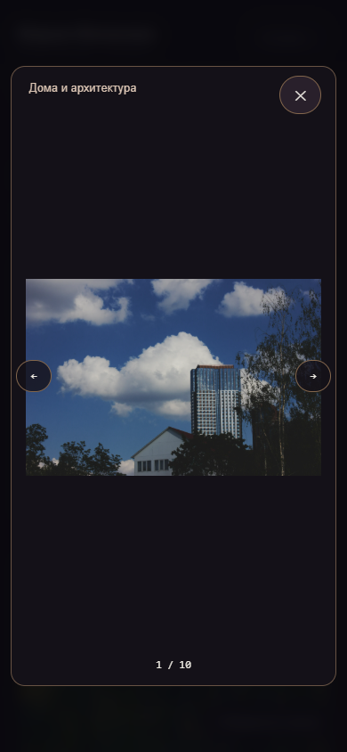

# Портфолио Марии Матвеевой - текущий дизайн

Скриншоты версии от 6 октября 2026 года. Основная страница: `folders.html`.
Это изображения текущего прототипа, не исходники сайта. Нижние разделы продолжают дорабатываться.

## Главный экран

## SoulArt

## Reform

## #Картавый - фотография

## Мобильная версия

Полные страницы: `04-soulart-full-page.png`, `12-reform-full-page.png`,
`15-photography-full-page.png`, `19-soulart-mobile.png`, `21-photography-mobile.png`.

Для GitHub загрузите эту папку целиком: изображения и README используют относительные пути.
Личные фотографии включены по запросу автора. Публикация репозитория сделает их общедоступными.
